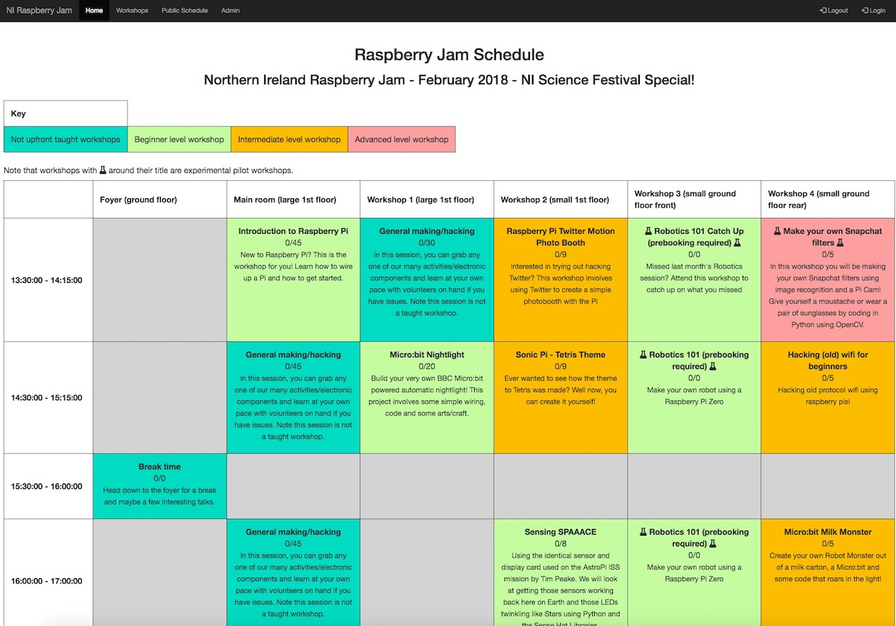
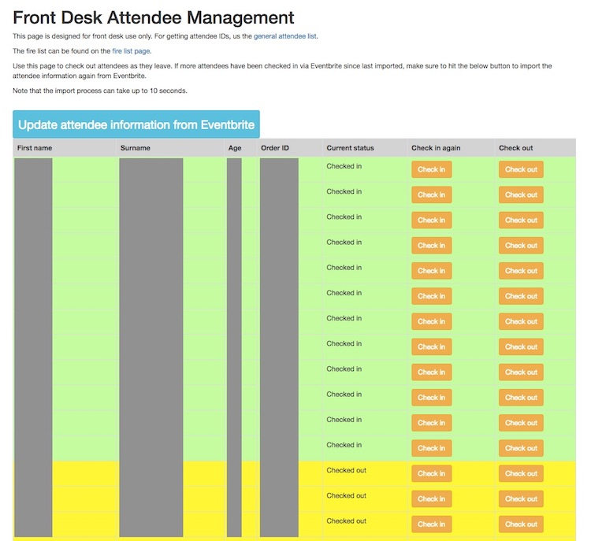

# Northern Ireland Raspberry Jam Information System
NIJIS is a system built for the Northern Ireland Raspberry Jam to manage a number of aspects of our events. These include
- Workshop management/booking.
- Volunteer attendance to each Jam.
- Volunteer on the day management.
- Attendee management (for front desk).
- Fire list (who is in the building).

The current list of features, along with what is still be worked on can be found in the [Proposed spec](NIJIS-spec.md)   .

The system is based off Python 3, along with Flask, a MySQL DB, SQLAlchemy and the Eventbrite API library.    

## Installation   
To install, run the following command from inside the `ni_jam_information_system` folder.    
```
python3 setup.py install
```    

As well as the required libraries, you also need a MySQL server set up. Create a schema to use for NIJIS (default is just NIJIS). 
Once your schema is created, copy secrets/config_example.py to secrets/config.py and populate it.   

To start the project 
```bash
python3 main.py
```   
On first run, keep an eye on the console as it will ask for details for super admin account.

If running a full scale setup, it should be run by Gunicorn with a proxy in front (like Nginx).

# Screenshots
## Public schedule page

   
## Attendee workshop signup page

   
## Front desk attendee management page

   
## Volunteer workshop signup page

   
## Workshop management page

