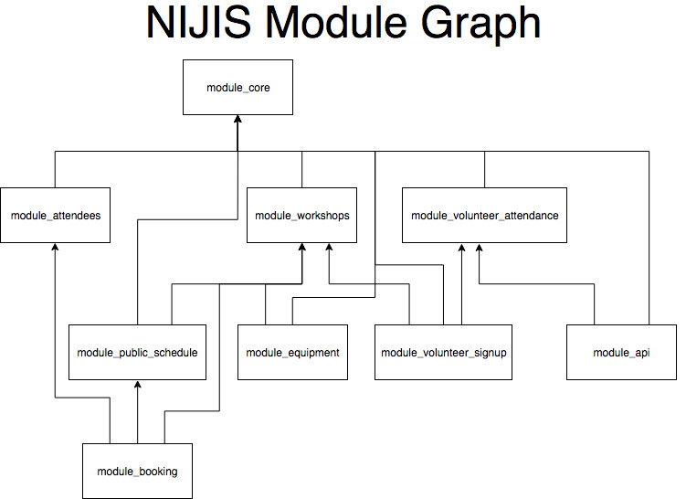

# NIJIS Modules   

NIJIS is split into a set of modules that can be enabled/disabled via the config file (found at /config/config.ini). They are

## Core
#### module_core
 - Home page
 - Admin home page
 - Login/register/forgot password
 - Add Jam
 - User management

## Attendee management
#### module_attendees
Depends on Core being enabled.
 - Attendee list
 - Front desk list
 - Fire list

## Public Schedule
#### module_public_schedule
Depends on Core and Workshops being enabled.
 - Public Schedule

## Booking
#### module_booking
Depends on Core, Workshops and Public Schedule being enabled.
 - Ticket sign in home page
 - Book workshops

## Workshops
#### module_workshops
Depends on Core being enabled.
 - Workshop catalog
 - Workshop scheduling
 - Jam setup
 
 
## Volunteer attendance
#### module_volunteer_attendance
Depends on Core being enabled.
 - Volunteer attendance

## Volunteer signup
#### module_volunteer_signup
Depends on Core and Workshops being enabled.
 - Volunteer signup

## API
#### module_api
Depends on Core and Volunteer Attendance being enabled.
 - Jam info
 - Users not responded

## Equipment
#### module_equipment
Depends on Core and Workshops being enabled.
 - Equipment
 - Inventories
 
 
 ## Finance
 #### module_finance   
 Depends on Core being enabled.  
 Note this module is not recommended for use outside of the NI Raspberry Jam, as it is heavily customised to the working processes we use.   
 - Volunteer expenses
 - Organisation ledger